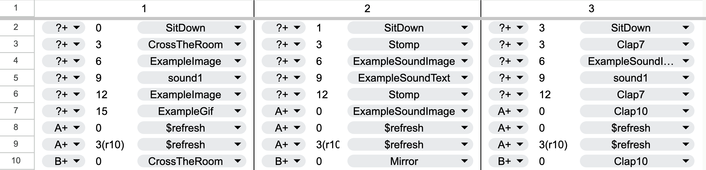
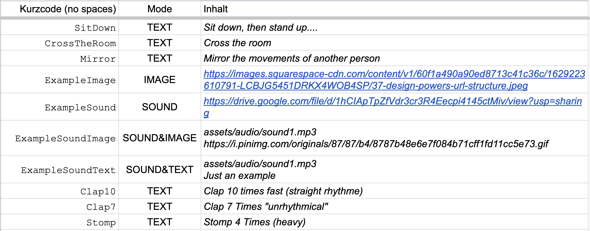
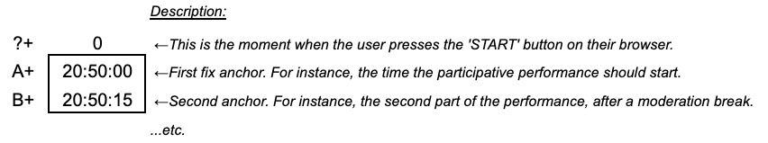

# 📱SHOWING

*A browser-based action-score player for distributed performance*

**SHOWING** is a lightweight web app (served via GitHub Pages) that reads a **CSV score** (typically from Google Sheets) and schedules **text, image, and sound cues** on a performer’s device, based on local time or relative timing.

Each performer opens the same link but receives **their own column** of instructions.

No server, no login, no installation.

---

## 1. Basic idea

* The **score lives in a spreadsheet**
* **Each column = one performer**
* **Each row = one scheduled action**
* The app:

  * waits for the performer to press **Start**
  * treats that moment as *time zero*
  * then executes cues at the specified times

---

## 2. Hosting the app (once)

1. Put `index.html` in a GitHub repository
2. Enable **GitHub Pages** (Settings → Pages → deploy from main branch)
3. Note the public URL, e.g.:

```
https://yourname.github.io/showing/
```

That’s the app URL performers will open.

---

## 3. Preparing the score (Google Sheets)

### 3.1 Spreadsheet SCORE

The _composing_ takes place in a shared [Google Spreadsheet](https://docs.google.com/spreadsheets/d/1ax-qEYPj7ZKxs-lyc61jOVHsFHbUBr_XQTCiB127cjQ/edit?gid=88783355#gid=88783355). There the actions and time intervals are set:



The actions refered there, are described in another sheet ('Aktionen')



And the letters that the time intervals refer to are ['**anchors**'](https://docs.google.com/spreadsheets/d/1ax-qEYPj7ZKxs-lyc61jOVHsFHbUBr_XQTCiB127cjQ/edit?gid=258500460#gid=258500460) to specific fixed times that can be edited independently of the score:



### 3.2 Spreadsheet structure

From there, a csv ([*_showing*](https://docs.google.com/spreadsheets/d/1ax-qEYPj7ZKxs-lyc61jOVHsFHbUBr_XQTCiB127cjQ/edit?gid=584592538#gid=584592538)) is parsed, with the following structure:

* **No header row required**
* Each column is one performer (A = performer 1, B = performer 2, etc.)
* Each cell contains **one action line**

Example:

| Performer 1                            | Performer 2           | Performer 3           |
| -------------------------------------- | --------------------- | --------------------- |
| 0:0:0+0s TEXT=Welcome                  | 0:0:0+0s TEXT=Welcome | 0:0:0+0s TEXT=Welcome |
| 0:0:0+10s SOUND=assets/audio/a.mp3     |                       |                       |
| 20:34:00+0s IMAGE=assets/img/scene.jpg |                       |                       |

---

### 3.3 Publishing the sheet as CSV (important)

In Google Sheets:

1. **File → Share → Publish to web**
2. Choose:

   * Format: **Comma-separated values (.csv)**
   * Sheet: the one containing the score
3. Publish
4. Copy the generated CSV URL

This URL is your **data source**.

> ⚠️ Google may cache updates. Changes usually appear after **~30 seconds to a few minutes**.

---

## 4. URL parameters (how performers join)

The app is controlled entirely via URL parameters.

### Required

```
?csv=PASTE_THE_PUBLISHED_CSV_URL_HERE
```

([URL-encoded](https://adrianartacho.github.io/UrlEncode/))

---

### Performer selection

```
&p=1        → performer column A
&p=2        → performer column B
&p=3        → performer column C
```

#### Random performer assignment

```
&p=random
```

or

```
&p=r
```

The app will randomly choose **one of the columns that actually contains data**.

---

### Debug mode (for rehearsals)

```
&debug=true
```

Shows:

* parsing errors
* loaded cues
* timing info
* refresh activity
* audio diagnostics

Performers normally **do not** use debug mode.

---

### Example full URL

```
https://yourname.github.io/showing/?csv=ENCODED_CSV_URL&p=2
```
*You may use this [little online tool](https://adrianartacho.github.io/UrlEncode/) to encode the URL

---

## 5. Action syntax (the score language)

Each cell must contain **one line**:

```
<TIME> <ACTION>
```

### 5.1 Time formats

#### Relative to Start

```
0:0:0+6s
```

→ 6 seconds after the performer presses **Start**

#### Absolute local time

```
20:34:00+23s
```

→ 23 seconds after 20:34:00 (local device time)

If that time has already passed today, it is scheduled **for tomorrow**.

---

### 5.2 Actions

#### TEXT

```
TEXT=Some text to display
```

* White text on black
* Automatically scaled to fill the screen

---

#### IMAGE

```
IMAGE=assets/images/photo.jpg
```

* Full-screen
* Covers the entire display (may crop)

---

#### SOUND

```
SOUND=assets/audio/sound.mp3
```

* Plays audio
* Shows a centered 🔊 icon

> Audio files should be hosted **inside the same GitHub Pages repo** for reliability.

---

#### Voting Actions (`VOTE`)

You can introduce interactive voting into your SHOWING app by using the `VOTE` action type. A `VOTE` line in the CSV lets you display multiple options as buttons. Each button can trigger a specific follow-up action (like showing text, an image, or playing a sound) once clicked, and also sends a vote to a Google Sheet via a Google Apps Script Web App.

**Example:**

```
20:50:0+0s VOTE=[Option A](TEXT=Thank you) [Option B](IMAGE=assets/image/cap.gif) [Option C](SOUND&TEXT=assets/audio/wow.mp3 Tam tam TAAAAM!)
```

When the user selects an option, the chosen action is performed and the vote is recorded in the linked Google Sheet. Just provide the `&vote=` URL parameter with the URL of your Apps Script Web App, and optionally `&show=` to tag the session. This turns your performance into an interactive experience where audience input can shape what happens next.

---

#### Combined actions

```
SOUND&IMAGE=assets/audio/a.mp3 assets/images/b.jpg
```

```
SOUND&TEXT=assets/audio/a.mp3 Listen carefully
```

---

### 5.3 Repeating actions `(rN)`

Actions can optionally be marked as **repeating** by adding `(rN)` to the time specification, where `N` is a number of seconds.
For example:

```
20:50:00+3(r10)s CMD=refreshdata
```

This means: *at 20:50:03, display the text once, and then repeat the same action every 10 seconds until the next scheduled action occurs (or until the end of the piece).*
The repetition applies to **all action types** (`TEXT`, `IMAGE`, `SOUND`, `SOUND&IMAGE`, `CMD`, etc.). When a new cue is reached, any ongoing repetition is automatically stopped and replaced by the next action.

---

## 6. Refreshing the score during the show

You can **edit the Google Sheet while the show is running**.

To make the app reload the data invisibly, add this line to the score:

```
0:0:0+0s CMD=refreshdata
```

When this cue fires, the app will:

1. Fetch the latest CSV from Google
2. Re-parse the performer’s column
3. Rebuild the remaining schedule
4. Continue without visual interruption

### Practical advice

* Place `CMD=refreshdata` **well before** you need the changes
* For safety, you can include **multiple refresh commands** at different times
* Expect adaptability on the order of **~30 seconds to a few minutes**, depending on Google’s cache

---

## 7. Performer experience

1. Performer opens the link
2. (Optional) taps **Fullscreen**
3. Taps **Start**
4. Puts the phone down
5. The device becomes a silent score reader

No scrolling, no interaction, no browser UI distractions.

---

## 8. Supported media formats

* **Audio:** mp3, wav, m4a (hosted locally)
* **Images:** jpg, png, webp
* **Text:** UTF-8 (emoji supported)

---

## 9. Known limitations

* Uses **local device time**, not an atomic clock
* Google Sheets CSV updates are **not instantaneous**
* True browser chrome removal is not possible on all devices
  (Fullscreen + “Add to Home Screen” gives best results)

---

## 10. Typical workflow

1. Rehearsal:

   * Use `&debug=true`
   * Test timing and parsing
2. Performance:

   * Remove `debug`
   * Distribute performer-specific links
3. During show:

   * Edit the Google Sheet
   * Let `CMD=refreshdata` adapt the score

---

## Overlap control (relative vs fixed-time cues)

By default, SHOWING treats **relative cues** (`0:0:0+...`) as *preparatory* actions that should only happen **before** the first fixed-time event.

### Default behavior

Once the **earliest fixed-time cue** is reached (e.g. `20:34:00+0s`), all remaining relative cues are **ignored**.

This makes it possible to:

* use `0:0:0+...` for warm-ups, onboarding, or instructions
* then “lock” the piece into a fixed-time structure once the performance begins

### Override

```
&overlap=yes
```

If set, **relative and fixed-time cues can overlap freely** for the entire duration of the piece.

### Summary

| Mode                   | Behavior                                               |
| ---------------------- | ------------------------------------------------------ |
| `overlap=no` (default) | Relative cues stop once the first fixed-time cue fires |
| `overlap=yes`          | All cues continue normally                             |

---

## Live score refreshing (automatic polling)

In addition to `CMD=refreshdata`, SHOWING can **automatically re-fetch the CSV at a fixed interval**.

### Enable

```
&refresh=10
```

→ Re-fetches the CSV every **10 seconds**

### What gets refreshed

* ✅ **Fixed-time cues** (absolute time cues)
* ❌ **Relative cues (`0:0:0+...`) are never replaced**

This ensures that:

* onboarding / warm-up instructions remain stable
* time-critical structure can be edited live from Google Sheets

### Use case

This enables a **“conductor behind the spreadsheet”** mode:
You can rewrite upcoming timed actions during the show, and performers’ devices will adapt automatically without reloading the page.

### Notes

* Refreshing starts **after “Sind Sie bereit?” is pressed**
* Google Sheets caching still applies (expect ~30–120s latency in some cases)
* If both are used:

  * `CMD=refreshdata` = manual refresh point
  * `&refresh=10` = continuous background refresh

---

## Word-breaking behavior (text readability vs screen fill)

SHOWING dynamically scales text to fill the screen. For long words, this can cause mid-word line breaks.

### Default

```
&breakwords=no
```

Words are **never broken across lines**. Text wraps only at spaces.
This favors **readability** over maximal screen coverage.

### Override

```
&breakwords=yes
```

Long words **may be split** to allow the text to fill more of the available space.
This favors **visual impact** and spatial density.

### Summary

| Mode                      | Behavior                                |
| ------------------------- | --------------------------------------- |
| `breakwords=no` (default) | Clean reading, no mid-word breaks       |
| `breakwords=yes`          | Aggressive layout, maximum screen usage |

---

## Debug mode and sound visibility

By default, sound cues are **silent visually**.

### Default (performance mode)

```
&debug=no
```

* Sound plays normally
* **No visual indicator** is shown
* The phone behaves like an invisible score

### Debug mode (rehearsal / technical)

```
&debug=yes
```

* Sound plays
* A **🔊 emoji appears** when audio is triggered
* Debug panel shows:

  * timing
  * parsing errors
  * refresh activity
  * fired cues

This separates:

> **performative experience** from **technical rehearsal interface**

---

## Full parameter summary (extended)

| Parameter    | Default | Purpose                                   |
| ------------ | ------- | ----------------------------------------- |
| `csv`        | —       | CSV score URL (required)                  |
| `p`          | `r`     | Performer column or `random`              |
| `debug`      | `no`    | Show diagnostics + sound emoji            |
| `overlap`    | `no`    | Allow relative cues after fixed-time cues |
| `refresh`    | —       | Auto-refresh CSV every N seconds          |
| `breakwords` | `no`    | Allow mid-word text breaking              |
| `vote`       | —       | Google Apps Script vote endpoint          |
| `show`       | —       | Optional show/session label               |

---

If you’d like, I can also give you a **one-page “cheat sheet” version** of this (PDF/printable) for students and collaborators — this is already at the level of a *micro-score language spec*, which is very on-brand for your transmedia practice 😉


---

## 11. License / reuse

This project is designed by [Adrián Artacho](https://www.artacho.at/) for **artistic, educational, and experimental use**.
Feel free to fork, adapt, and remix it for your own performances.

---

## [📝To-Do](https://trello.com/c/SrvTCYNW/281-showing)
